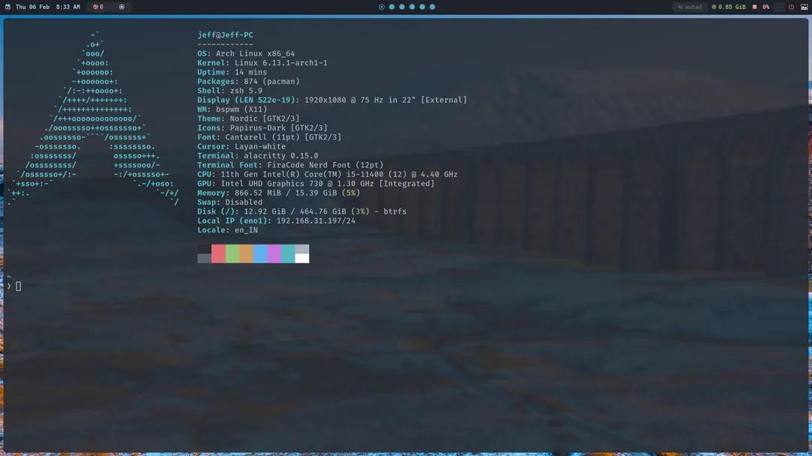

# 🏴‍☠️ Arch BSPWM Installer

A minimal Arch Linux setup script that configures BSPWM after installing Arch Linux using `archinstall` with the minimal preset.


## 🚀 Features
- **⚡ Automated Configuration**: Applies BSPWM setup seamlessly after Arch Linux installation.
- **🛠️ Minimal Installation**: Uses `archinstall` with the minimal preset for a clean base.
- **💡 Lightweight & Efficient**: No unnecessary bloat, just your customized Arch experience.

## 📥 Installation

### Prerequisites
- 🖥️ A USB drive (at least 2GB recommended)
- 💾 A system capable of booting from USB

### Steps
1. 🔗 Download the latest Arch Linux ISO from [archlinux.org](https://archlinux.org/download/).
2. 📀 Create a bootable USB using `dd` or a tool like Balena Etcher:
   ```bash
   sudo dd if=archlinux.iso of=/dev/sdX bs=4M status=progress && sync
   ```
   (Replace `/dev/sdX` with your USB drive.)
3. 🏁 Boot from the USB and install Arch Linux using `archinstall`, selecting the **minimal** preset.
4. 🏗️ After installation, clone this repository and run the setup script:
   ```bash
   git clone https://github.com/Jeffrey2081/arch-bspwm.git
   cd arch-bspwm
   ./install.sh
   ```

## 🎨 Customization
This setup includes your BSPWM configuration from [arch-bspwm](https://github.com/Jeffrey2081/arch-bspwm). To modify:
```bash
cd ~/.config/bspwm
nano bspwmrc  # Modify startup settings
```

## 🖼️ Screenshot


## 🤝 Contributing
Pull requests and improvements are welcome! Feel free to fork and customize.

## 🔗 Connect with Me
[](https://www.instagram.com/jeffrey__2081/)

---

⚡ Powered by Arch Linux & BSPWM 🚀
